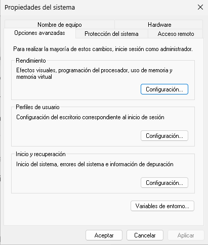

  \newpage
  \renewcommand\tablename{Tabla}

---


# Què són les variables d'entorn?

Les **variables d'entorn** són valors definits pel sistema operatiu (o per l'usuari) que proporcionen informació sobre l'entorn en què s'està executant un procés. Són útils per automatitzar scripts, configurar aplicacions o obtenir dades sobre l'estat del sistema.

---

# Com veure les variables d'entorn en CMD

## Veure totes les variables:

```cmd
set
```

## Veure una variable concreta:

```cmd
echo %NOM_VARIABLE%
```

Exemple:

```cmd
echo %PATH%
```

---

# Variables d'entorn més importants

| Variable                | Descripció                                                                  |
| ----------------------- | --------------------------------------------------------------------------- |
| `PATH`                  | Directori(s) on Windows busca executables                                   |
| `PATHEXT`               | Extensions que el sistema reconeix com a executables (`.EXE`, `.BAT`, etc.) |
| `USERNAME`              | Nom de l’usuari actual                                                      |
| `USERPROFILE`           | Ruta completa a la carpeta de l’usuari                                      |
| `HOMEDRIVE`             | Unitat principal (`C:` normalment)                                          |
| `HOMEPATH`              | Ruta relativa dins de `USERPROFILE`                                         |
| `APPDATA`               | Ruta de configuració per a aplicacions (sincronitzada)                      |
| `LOCALAPPDATA`          | Ruta de configuració local per aplicacions (no sincronitzada)               |
| `TEMP` / `TMP`          | Carpeta temporal usada per aplicacions i el sistema                         |
| `COMPUTERNAME`          | Nom de l’ordinador                                                          |
| `OS`                    | Nom del sistema operatiu (normalment `Windows_NT`)                          |
| `SystemRoot` / `windir` | Ruta d’instal·lació de Windows                                              |
| `ProgramFiles`          | Ruta per defecte per a programes de 64 bits                                 |
| `ProgramFiles(x86)`     | Ruta per a programes de 32 bits en sistemes de 64 bits                      |
| `NUMBER_OF_PROCESSORS`  | Nombre de processadors disponibles                                          |
| `PROCESSOR_IDENTIFIER`  | Informació del CPU                                                          |

---

# Des de l'entorn gràfic

En **Configuració avançada del sistema**

Podeu trobar-ho en *Este Equipo | Propietats*
O executant **sysdm.cpl**


# Com definir o modificar variables d'entorn

## Definir temporalment (durant la sessió CMD actual):

```cmd
set NOM=valor
```

Exemple:

```cmd
set PROVA=Hola món
echo %PROVA%
```

## Definir permanentment (a través de l'entorn gràfic):

1. Escriu `SystemPropertiesAdvanced` en el CMD i prem Enter.
2. Fes clic a **Variables d'entorn**.
3. Afegeix, edita o esborra variables d’usuari o del sistema.

> No es poden modificar variables de sistema des del CMD sense usar eines com PowerShell o `setx`.

---

# Ús habitual de variables d'entorn

* En scripts `.bat` per fer referència a carpetes i usuaris:

```cmd
copy fitxer.txt %USERPROFILE%\Documents\
```

* Per controlar el comportament d'aplicacions i instal·ladors
* Per configurar entorns de desenvolupament (per exemple, `JAVA_HOME`, `PYTHONPATH`)

