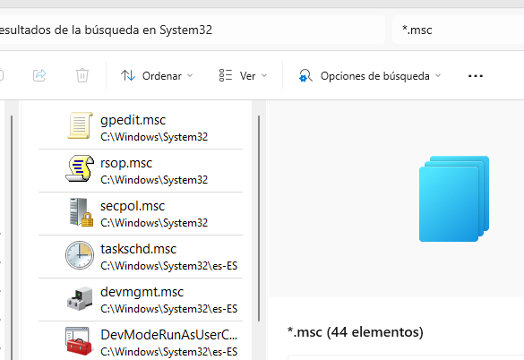
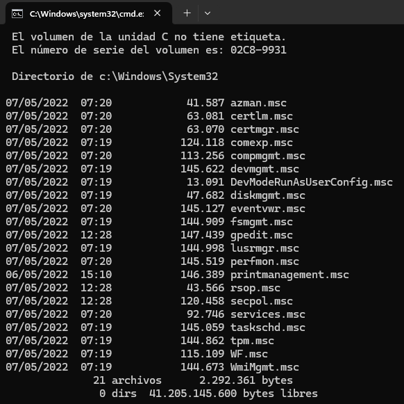
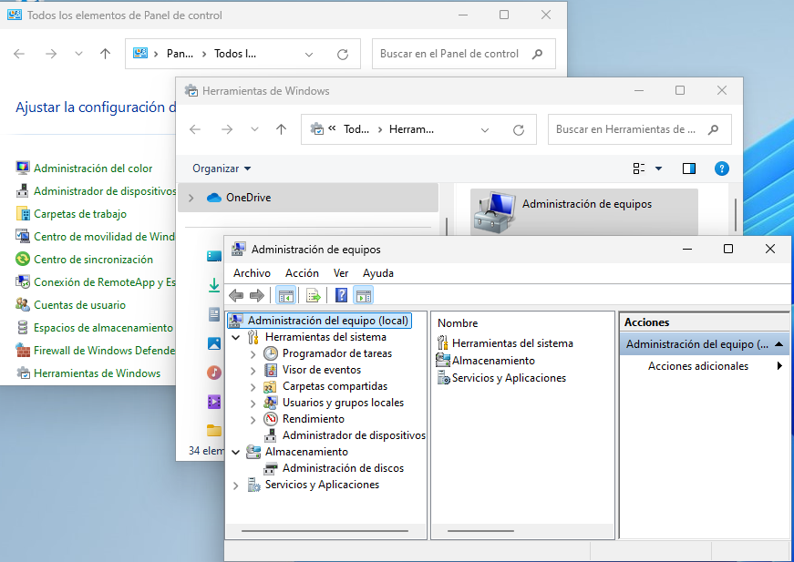
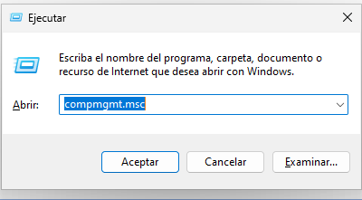
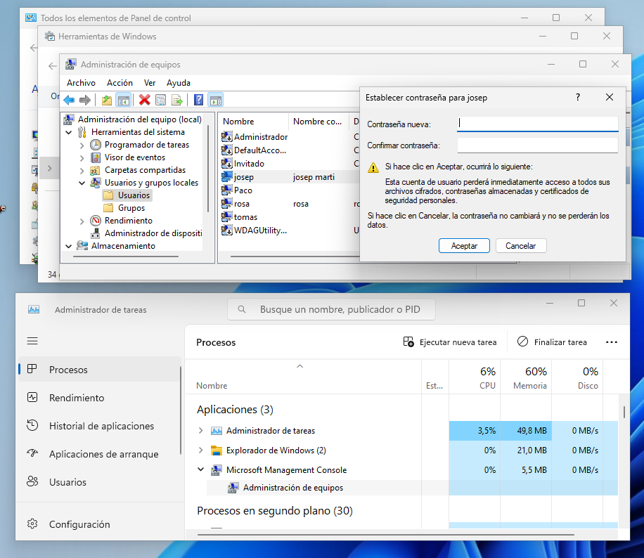

  \newpage
  \renewcommand\tablename{Tabla}

# 1.  DES DE L'ENTORN GRÀFIC. CONSOLES

# 1.1 LES CONSOLES COM A FITXERS.

Les Microsoft Management Console (fitxers amb extensió *.msc*) són ferramentes gràfiques per a tasques d'administració i gestió dels sistemes operatius Windows.

Podem trobar-les al directori d'instal·lació de Windows *c:\\windows\\system32*. 



*Nota*
> Veiem que els fitxers estan duplicats a la carpeta *c:\\windows\\system32\\es-ES*.

Des del interface de comandaments (CLI).

* Win + R: cmd

```cmd
dir c:\windows\system32\*.msc
```



# 1.2 RELACIÓ DE CONSOLES

Els fitxers .msc vistos a l'apartat anterior corresponen a consoles Microsoft Management Consoles (MMC) que poden ser:

* Consoles per a la gestió o administració d'un element del sistema (usuaris i grups; discos; procesos...).
* Consoles que n'agrupen 
* Consoles per a usos avançats.

A continuació, tenim una llista de les consoles MMC més comuns en Windows 11:

1. **compmgmt.msc** - **Gestió de l'equip**  Exemple de consola que agrupa altres. 
   Centralitza diverses eines de gestió del sistema com l'administració de discos, l'administració d'usuaris i grups, el visualitzador d'esdeveniments, i molt més.

2. **devmgmt.msc** - **Gestió de dispositius**  
   Gestiona el maquinari del sistema, incloent-hi la instal·lació, actualització i resolució de problemes dels controladors de dispositiu.

3. **diskmgmt.msc** - **Gestió de discos**  
   Permet administrar les particions dels discos durs, crear, eliminar i formatar volums, assignar lletres d'unitat, entre altres tasques.

4. **eventvwr.msc** - **Visualitzador d'esdeveniments**  
   Mostra els esdeveniments i registres del sistema, que poden ajudar a diagnosticar problemes i obtenir informació sobre l'activitat del sistema.

5. **secpol.msc** - **Política de seguretat local**  
   Administra les polítiques de seguretat locals del sistema, incloent-hi polítiques d'auditoria, polítiques de comptes i polítiques de restriccions de programari.

6. **gpedit.msc** - **Editor de polítiques de grup**  
   Gestiona les polítiques de grup del sistema, que es poden utilitzar per configurar i restringir comportaments del sistema i dels usuaris.

7. **services.msc** - **Serveis**  
   Administra els serveis del sistema, permetent iniciar, aturar i configurar serveis.

8. **taskschd.msc** - **Planificador de tasques**  
   Permet crear i gestionar tasques programades per executar-se automàticament en moments específics o en resposta a esdeveniments del sistema.

9. **certlm.msc** - **Certificats - Ordinador local**  
   Administra els certificats digitals en el context de l'ordinador local.

10. **printmanagement.msc** - **Gestió d'impressió**  
    Gestiona les impressores instal·lades, les cues d'impressió i els controladors d'impressora.

11. **fsmgmt.msc** - **Carpetes compartides**  
    Permet gestionar les carpetes compartides al sistema, incloent-hi la creació i configuració de comparticions, i l'administració de sessions i fitxers oberts.

12. **dfrgui.msc** - **Desfragmentador de disc**  
    Ajuda a optimitzar el rendiment del disc desfragmentant els volums.

13. **perfmon.msc** - **Monitor de rendiment**  
    Proporciona eines per monitoritzar el rendiment del sistema, incloent-hi registres i comptadors de rendiment.


# 2 CONSOLA D'ADMINISTRACIÓ D'EQUIPS. (compmgmt.msc)

Proporciona una interfície centralitzada per gestionar diversos aspectes d'un ordinador.

Des de l'entorn gràfic anem a *Panel de Control/Herramientas de Windows[¹]/Administrador de Equipos*. 



Per accedir directament a la Consola d'Administració d'Equips:

Tot seguit observarem l'opció centralitzada des d'on podrem fer les gestions sobre el nostre equip.

Des de l'entorn gràfic anem a *Panel de Control/Herramientas de Windows[¹]/Administrador de Equipos*. 

O executem el .msc corresponent:



Es fa servir per a una gestió més completa i detallada del sistema, especialment útil per a administradors que necessiten accedir a múltiples eines de gestió en un sol lloc.

Aquí tens la informació detallada sobre `compmgmt.msc` (Gestió de l'equip), amb el nom de les consoles o eines associades a cada component:

**Altres consoles incloses:**

  - **Gestor de discos:** Administració de particions i discs durs.
    - **Nom de la consola/eina:** `diskmgmt.msc`
    - **Descripció:** Permet crear, suprimir, formatar i redimensionar particions, així com gestionar discs físics.

  - **Visualitzador d'esdeveniments:** Registres d'esdeveniments del sistema, aplicacions i seguretat.
    - **Nom de la consola/eina:** `eventvwr.msc`
    - **Descripció:** Mostra esdeveniments registrats pel sistema operatiu, aplicacions i serveis, útil per al diagnòstic i seguiment de problemes.

  - **Carpetes compartides:** Gestió de carpetes i recursos compartits a la xarxa.
    - **Nom de la consola/eina:** `fsmgmt.msc`
    - **Descripció:** Gestiona les carpetes i recursos que es comparteixen a la xarxa, incloent la supervisió d'usuaris connectats i sessions obertes.

  - **Gestor de dispositius:** Administració de controladors i dispositius de maquinari.
    - **Nom de la consola/eina:** `devmgmt.msc`
    - **Descripció:** Permet gestionar els dispositius de maquinari instal·lats, actualitzar o revertir controladors, i solucionar problemes de maquinari.

  - **Serveis i aplicacions:** Administració de serveis del sistema, com ara el servidor web o de bases de dades.
    - **Nom de la consola/eina:** `services.msc`
    - **Descripció:** Permet gestionar els serveis del sistema operatiu, com ara iniciar, aturar o configurar serveis automàticament.

  - **Usuaris i grups locals:** Inclou una secció per gestionar usuaris i grups locals, similar a `lusrmgr.msc`.
    - **Nom de la consola/eina:** `lusrmgr.msc`
    - **Descripció:** Permet crear, modificar i suprimir comptes d'usuari i grups locals, així com gestionar les seves pertinençes i permisos.

- **Àmbit d'aplicació:** Ofereix una visió més àmplia i centralitzada de la gestió de l'ordinador, incloent aspectes de maquinari, serveis i altres configuracions del sistema.




[1]: En versions anteriors: "Herramientas Administrativas"


