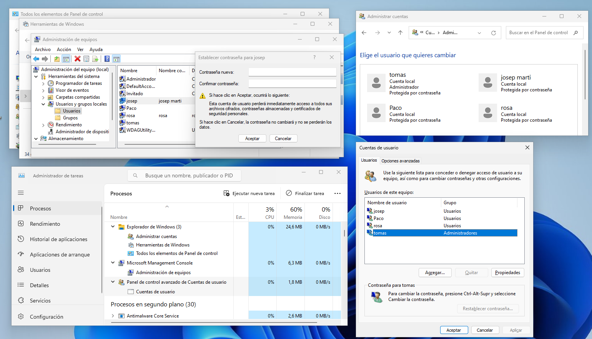

  \newpage
  \renewcommand\tablename{Tabla}

# 1.  DES DE L'ENTORN GRÀFIC


Tot seguit observarem tres opcions per fer algunes gestions sobre usuaris. La més completa, pràctica i que serà que usares serà la primera que estudiarem (1.1).


## 1.1 CONSOLA D'ADMINISTRACIÓ D'EQUIPS. (compmgmt.msc)

Des de l'entorn gràfic anem a *Panel de Control/Herramientas de Windows[¹]/Administrador de Equipos*. 

En l'apartat de *Usuarios y grupos locales* d'esta consola disposarem de totes les ferramentes necessàries per a la gestió de comptes (usuaris i grups). És l'opció des d'on treballarem.


**Avanç**

Les consoles gràfiques de Windows (MSC)
Les Microsoft Management Console (fitxers amb extensió *.msc*) són ferramentes gràfiques per a tasques d'administració i gestió dels sistemes operatius Windows.
Podem trobar-les al directori d'instal·lació de Windows *c:\\windows\\system32*. 
Més avant farem un repàs de totes.

Per accedir directament:


## 1.2 ALTRES OPCIONS

Des del GUI podem fer algunes gestions amb els comptes d'usuaris.

### 1.2.1 Panel de Control. Administrar cuentas.

{width="80%"}

En esta opció veien que podem canviar el tipus de compte (Estàndar/Administrador) i poc més.


**Equivalències**

- El tipus per defecte "Estándard" equival al grup "Usuarios".
- El tipus "Administradores" equival al grup d'usuaris "Administradores"

### 1.2.2  Ferramenta *netplwiz.exe*

Windows + R i executem  **netplwiz**.
Similar als Control Panel Applets (CPL), components de Panel de Control que en permeten l'accés a determinades configuracions.


En esta opció ens mostra els noms de grups d'usuaris als quals pertany cada usuari. Ens permet afegir a algun grup distint d'Usuarios (Estándar) i Administradores però no podem crear grups nous.


 
**Avanç**

Com podem observar a les imatges, cadascuna de les opcions gràfiques en execució genera un procés distint.
A les imatges següents podem observar les tres alternatives gràfiques obertes al mateix temps i fixar-nos-hi en les **tasques (procesos)** que s'hi veuen a l'*Administrador de Tasques*
També veiem com el component de Windows Consola de Equipos, en executar-se dos vegades, genera dos processos. 



![])png/compmgmtTaskmanager.png)

# 2 USUARIS I GRUPS

## 2.1  Grups per defecte

La instal·lació de Windows crea uns grups per defecte com veiem a la imatge següent. Ens centrarem en els dos principals

- El Grup **Administradores**.
    Que tindran **drets** per realitzar qualsevol tasca que afecte a la configuració i **permisos** per a modificar carpetes i fitxers. 
    
- El Grup **Usuarios**
  No tindran drets per fer cap modificació sobre la configuració (per exemple instal·lacions). I només podran fer modificacions sobre fitxers i carpetes de la seua propietat. 
  
  
  Estos grups equivalen al "tipo de cuenta", "Administrador/Estándar" de les opcions del punt 1.2
  
## 2.2  Nous grups d'usuari

A banda d'estos dos grups básics, existeixen altres que crea també el sistema per al seu propi funcionament, però a nosaltres pot interessar-nos crear altres grups d'usuaris amb la finalitat d'establir quines persones poden fer determinades coses i quines altres no sobre les carpetes i fitxers o sobre el software de la màquina.

A l'exemple que veiem hem creat un grup amb el nom "Familia".


> Avanç: Un **permís** és una autorització sobre que se li dóna a un usuari (o grup) per a poder:
>
> 1. Llegir o
> 2. Escriure o 
> 3. Canviar els permisos (1 i 2) o el *propietari*
> 
> unes carpetes o fitxers
>
> El **propietari** és, per defecte, l'usuari que ha creat la carpeta o fitxer. 
> 
>( Ho abordarem més avant )


El que hem de tenir en compte és que, si bé per defecte un usuari és *administrador* o *estándard* de forma exclusiva, podem crear nous grups i incloure-hi els usuaris que vullguem.

Fixem-nos a la imatge següent. Observem que hem creat un grup "Familia" al qual hem afegit un usuari que pertany al grup "Administradores" ( Tomas) i també un usuari estandard del grup "Usuarios" 

{width="80%"}

## 2.3 Acumulació de permisos de lectura, escriptura o canvi

Per tant, un mateix usuari pot pertànyer a més d'un grup. En estos casos, els permisos de cadascun dels grups als quals pertany se sumen.

> A la següent secció estudiarem el permisos amb més detall. 


# 3. VISIÓ DES DE L'INTERFACE DE COMANDAMENTS

Encara que en Windows11 serà més habitual treballar en l'entorn gràfic hem de tenir sempre present que disposem de dos shells o interface de comandaments:

- La consola de comandaments o cmd
- Powershell

En una unitat següent s'estudiarà com crear modificar comptes des d'estos entorns CLI. Ara, fem este avanç només per comprovar que els usuaris estan creats però el seu perfil ( carpetes encara no ).

## 3.1 Des de la consola CMD:

Pulsem *Win-R : cmd* i comprovem amb
```cmd
net users
```


```cmd
net localgroup
```


## 3.2 Des de Powershell
Puelsem *Win-R: powershell* i comprovem amb
```powershell
get-LocalUser
```

```powershell
get-LocalGroup
```


# 5 VISIÓ AL REGISTRE del SISTEMA

Observem com es registra al Registre del sistema els perfils (profiles) de cada usuari.
**Avanç**
El Registre del sistema (*C:\\WINDOWS\\regedit.exe*) és un component essencial de tots el sistemes Windows. Formalment és una base de dades jeràrquica que emmagatzema configuracions i opcions del sistema operatiu i les aplicacions.


# 4 PERFIL DE L'USUARI

El perfil comprén tots els directoris ( "Els meus Documents, Descàrregues...") i altres característiques que són exlusives de cada usuari o comuns. 

Veiem les carpetes:


## 4.1 Creació del perfil

Segurament si hem creat un usuari nou, haurem comprovat en l'anterior punt que l'usuari acabat de crear:

- Apareix al GUI. Consola gràfica 8 compmgmt.msc ) i les altres opcions.
- Apareix al CLI. *net user* i *get-localuser* 
- No apareix al registre del sistema la entrada a *ProfileList*
- No apareixen les carpetes de perfil personal a *C:\\usuarios*

> Quan es crea el perfil de l'usuari?
> El perfil dels usuaris ( c:\\users|usuari\\...es crea quan, una vegad creat, iniciem per primera vegada sessió amb
> ell. 
> Notarem que el primer inci de sessió es fa molt lent, sobretot si no hem desactivat Cortana
> Com a nota podem avançar que en Linux veurem que ocorre el mateix.

Una vegada creat el perfil, podem entrar dins de la carpeta del nostre usuari i observar tres subcarpetes:

* Default
* Públic
* Carpeta específica de cada usuari 

Cadascuna té una funció que veiem tot seguit.

## 4.1 Default

La carpeta **Default** és una plantilla per a la creació de nous perfils d'usuari. Conté configuracions i arxius predeterminats que es copien a qualsevol nou compte d'usuari quan es crea. Ací es troben:

- **Configuracions del compte**: Preferències i configuracions d'aplicacions predeterminades.
- **Carpetes d'usuari predeterminades**: Documents, Imatges, Música, Vídeos, Escriptori, Descàrregues, etc.
- **Arxius de configuració**: Arxius de personalització de l'entorn d'usuari, com el fons d'escriptori, icones, accessos directes, etc.

Els nous usuaris de l'ordinador hereten estos arxius i configuracions la primera vegada que inicien sessió.


## 4.2 Públic

La carpeta **Públic**. Carpeta compartida accessible per tots els usuaris de l'equip per compartir arxius sense cap restricció.


## 4.3 Carpeta de l'Usuari Específic

Cada usuari té la seva pròpia carpeta, que emmagatzema els seus arxius personals i configuracions específiques. Esta carpeta inclou:

- **Carpetes personals**: Documents, Imatges, Música, Vídeos, Escriptori, Descàrregues.
- **Configuracions d'usuari**: Configuracions específiques de l'usuari que afectaran a com pot usar el SO i aplicacions software.
- **Arxius i configuracions personals**: Qualsevol arxiu que l'usuari guarde a seues carpetes personals i també les configuracions personalitzades.


>
> Només podrem entrar a carpeta d'altres usuaris si som Administrador. Es proposa més avant una activitat per comprovar-ho.

  \newpage
  
# 5 Activitats

## Activitat 1

1.  Des de la Consola gràfica, crea un usuari que pertanya al grup Administradores i un altre que siga no, només al grup Usuarios amb els noms respectius:

* Adm1
* User1

2.  Assegura't que l'usuari haja de canviar la contrassenya la primera vegada d'iniciar sessió en els dos usuaris.

3.  Inicia sessió, amb l'usuari *Adm1*.
    3.1 Crea un fitxer *Doc1.txt* a la carpeta personal de Adm1 C:\\users\\Adm1\\Documentos
    3.2 Crea un  nou fitxer *EnPublic.txt* i guarda'l a la carpeta C:\\Public\\Documents
    3.3 Crea una carpeta de C:\\Default\\Documents\\Defecte
    3.4 Dins d'esta, crea un fitxer *def1.txt*
    3.4 Observa els continguts de les carpetes C:\\Users\\Adm1 i C:\\Users\\User1 

4.  Inicia sessió amb *User1*. Ara comprovarem l'efecte dels canvis fets adés en este usuari nou.
    4.1 Entra al perfil de User1 C:\\users\\User1
    4.2 Comprova si apareix la carpeta *Defecte* i el seu contingut.
    4.3 Intenta entrar a Public i mira qué tens
  

[1]: En versions anteriors: "Herramientas Administrativas"