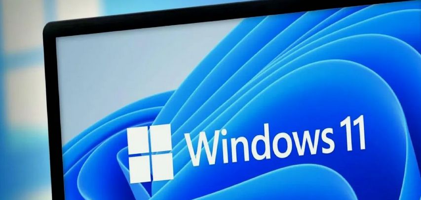

---
output:
  html_document: default
  pdf_document: default
---
# SISTEMES OPERATIUS MONOLLOC
|||
|:---------|--:|
|{width=90%}|Tomàs Ferrandis Moscardó tomasferrandis@gmail.com   {width=30%}| |

El contingut d'este repositori és per al mòdul SOM de 1r de SMX i està compartit amb llicència CC BY-NC-ND.

## Windows 11
|||
------------------------- | -- | --
1. [Instal·lació Windows 11](manteniment/instalar.html)||
2. [Recuperació de la instal·lació Windows 11](manteniment/recuperar.html)||
3. [Introducció a l'interface gràfic GUI)](interfaces/interfaces.html)||
4. [Introducció al sistema de fitxers](sf/fitxers.html)||
5. [Gestió de comptes locals (usuaris i grups)](gestions/comptesLocals.html)||
6. [Instal·lació i desintal·lació de Software](software/software.html)||
7. [Atributs, propietat i permisos SHARE](gestions/permisos.html)||

|||
|:------|--:|
|*SOM © 2024 by Tomàs Ferrandis Moscardó is licensed under CC BY-NC-ND 4.0*|{width=30%}|
