  \newpage
  \renewcommand\tablename{Tabla}

# 1 UNITATS 

Per accedir a qualsevol directori en Windows podem usar unes etiquetes (lletres) que indiquen un inici de ruta. Esta lletra pot indicar.

1.  Una unitat física de memòria secundària: disc dur, pen-drive, tarja externa, DVD...
2.  Una partició d'una unitat fisica de memòria secundaria. 
3.  Una carpeta compartida en un xarxa.

## 1.1 Unitats físiques

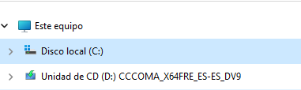

## 1.2 Particions

## 1.3 Carpetes compartides

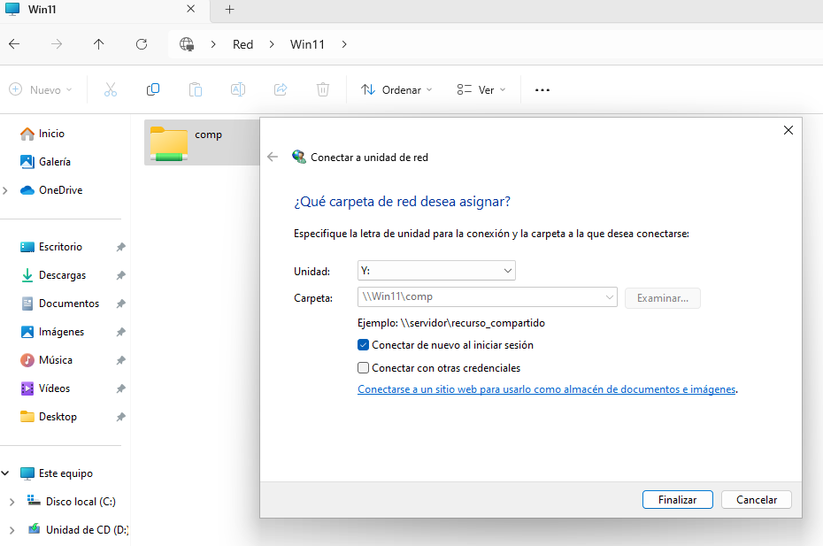

**Avanç**

> En Windows quan per indicar la ubicació d'un fitxer o carpeta comencem per una unitat, parlarem de *rutes absolutes*. Alguns exemples serien: *C:\\Windows*; *F:\\ParticioDades\\CopiaDeSeguretat*;*  Z:\\UnitatDeXarxa\\FacturesAntigues*

# 2 OPCIONS DE L'EXPLORADOR

L'explorador de Windows és molt versàtil. Ens permet configurar la vista per mostrar-nos i amagar-nos característiques del sistema de fitxers. 
Abans de passar al següents punts necessitem canviar alguna configuració de la vista que ens ve per defecte. Primer escollirem una vista que ens mostre informació sobre els fitxers i carpetes (metadades).

## 2.1 Vista de detalls o metadades

En l'opció VER triem *Detalles* És la configuració de Vista que més informació ens aporta.

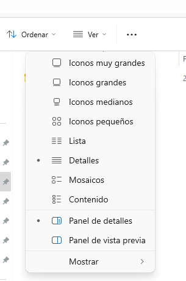

Després seleccionen què volem veure amb *Mostrar* 

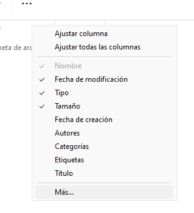

... podem buscar més detalls amb *Más*

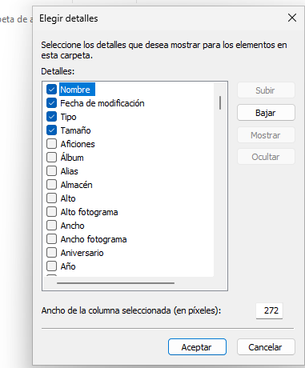

Veiem que podem seleccionar moltes característiques. Algunes prou interessants poden ser:

* Data de creació
* Data de modificació
* Data darrera accès
* Tamany
* Propietari
* Atributs

Per tenir una vista com esta...

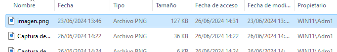

## 2.2 Opciones de carpetes

En l'opció "Ver" de cada carpeta, podem triar què volem que ens mostre o oculte entre altres peculiaritats de l'explorador de Windows.

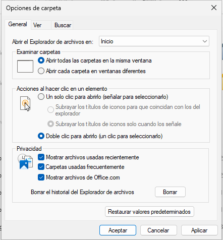

Hi ha moltes opcions interessants a les **Opciones de carpeta**. Investigueu-ho! 
Veiem 3 canvis interessants per poder fer alguna tasca com a "Administradors":

* Veure tots els fitxers i carpetes ocultes.
* Veure totes les extensions dels fitxers.
* Ocultar arxius protegits del SO (recomanat)

En els **...** desplegar i triar *Opciones*

### 2.2.1 Mostrar o no carpetes i fitxers ocults

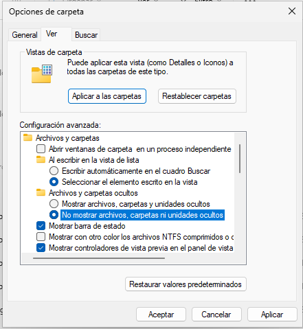

Altra foram d'activar esta opció és:

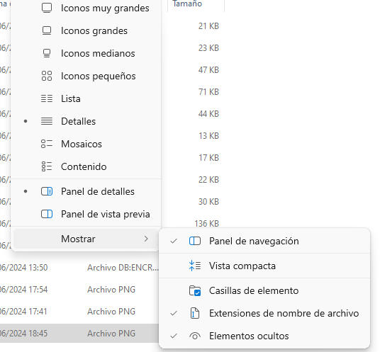

### 2.2.2 No ocultar les extensions conegudes de fitxers

S'amaguen per defecte extensions de fitxers com *txt, jpg...*. Per a tasques de manteniment pot interessar-nos canviar l'extensió, nom etc...

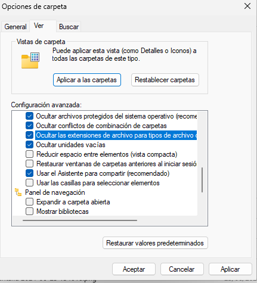

És recomanable ocultar els arxius del SO protegits per evitar que, accidentament, es borren o canvien de nom o lloc però un usuari administrador en algun moment pot necessitar veure'ls

### 2.2.3 Ocultar els arxius protegits del SO

Per seguretat la instal·lació del Windows deixa estos arxius ocults. 

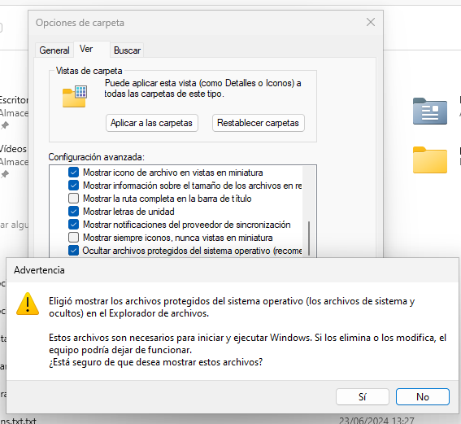

Podem fer canvis sobre tota la Unitat que s'aplicaran a tota una carpeta. Encara que amb "Aplicar a las carpetas" també s'aplicaria a tota la unitat.

**Recomanació**
> Una pràctica convenient és fer visibles els arxius de SO o ocults estrictament de la carpeta a manipular.
> També es recomnables tornar a ocultar els arxius i carpetes des sistema i els ocults una vegada realitzades les tasques de menteniment per als qual els hem fet visibles.

## 2.3 Aplicar a altres carpetes

Windows permet que la configuració de la "Vista" que hem establert segons el punts 2.1 i 2.2 anteriors en una carpeta puga extendre's a altres carpetes del mateix "tipus" (^1) amb el botó "Aplicar a las carpetas". Este canvi es pot revertir amb "Restaurar carpetas".
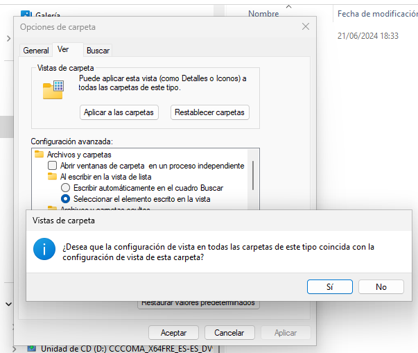
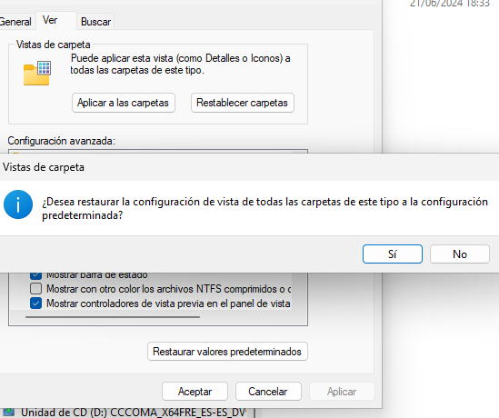

[^1]: No existeixen ni en Windows ni en Linux carpetes de diferents "tipus". El missatge, gens encertat, es refereix a subcarpetes o altres carpetes de la mateixa unitat amb contingut similar. 

## 2.4 Exemple comentat

Si observem les següents vistes comprovem que l'ocultació de les extensions conegudes pot mostrar-nos fitxers amb el "mateix" nom i icona. Si estem treballant amb la mateixa imatge guardant-la en diferents formats o estem exportant dades a fulles de càlcul de MS Office o LibreOffice o fitxers csv, no hi ha manera de diferenciar. A no ser que, com a l'exemple, mostrem el detall "Tipo".

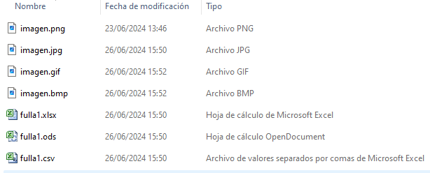

**Avanç**
> Ho vorem amb més detall quan estudiem el atributs. Per ocultar un fitxer o carpeta des del GUI ho fem amb una marca.

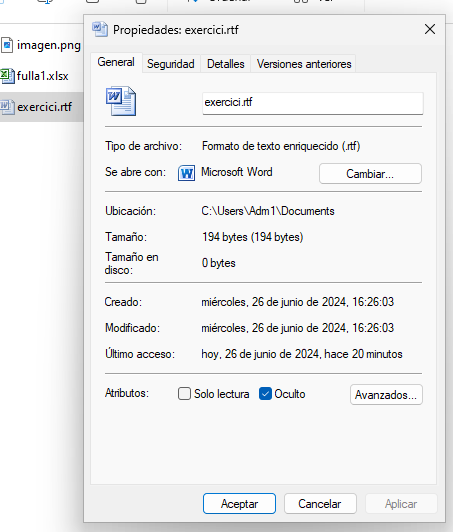

## 2.4 CERCAR

Des de l'explorador podem buscar un fitxer o directori. La recerca es farà a partir de la carpeta en què ens situem. A més, cal tindre en compte que s'hi localitzaran els arxiu i carpetes ocultes com podeu comprovar a l'exemple següent.

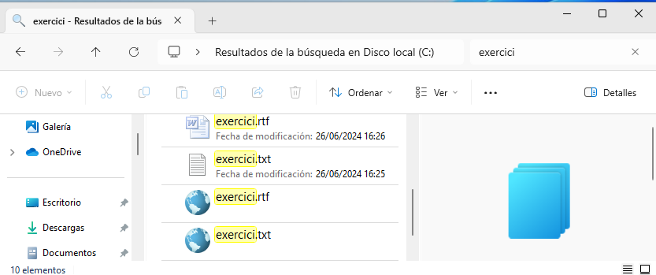

# 3. CARPETES PRINCIPALS de WINDOWS 11

## 3.1 PER DEFECTE

En la instal·lació de Windows 11 s'hi creen les carpetes principals següents:

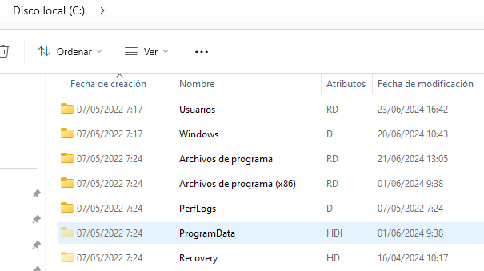

Les funcions són:

* **C:\\Windows** Conté els arxius del sistema operatiu Windows.
* **C:\\Program Files** Conté els programes instal·lats (per a aplicacions de 64 bits).
* **C:\\Program Files** (x86): Conté els programes instal·lats (per a aplicacions de 32 bits).
* **C:\\Users** Conté les carpetes dels usuaris, incloent-hi documents, escriptori, descàrregues, etc.
* **C:\\ProgramData** Emmagatzema les dades de les aplicacions compartides entre tots els usuaris del sistema.
* **C:\\PerfLogs** Conté els registres de rendiment i diagnòstic del sistema.
* **C:\\Recovery** Emmagatzema els arxius necessaris per a la recuperació del sistema.

## 3.2 NOVES CARPETES

A la unitat C:\\ poden crear-se'n més en funció de posteriors configuracions i instal·lacions. 

Per exemple:

* Si activem la recuperació del sistema es crea la carpeta **C:\\$Recycle.bin**
* Si instal·lem el MS Office s'hi crea **C:\\MSOCache**

**Notes**

>* El "$" com a inici de no de carpeta sol posar-lo el sistema en carpetes ocultes. 
>* Si no tenim habilitada l'opció de mostrar carpetes i arxius ocults (com hem vist adés) no veiem estes carpetes.

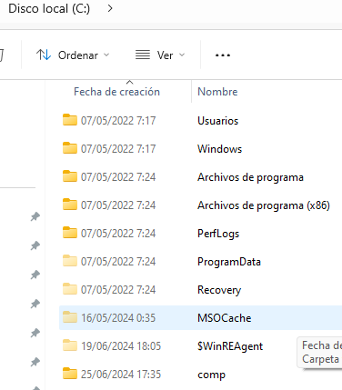

# 4. PAPERERA DE RECICLATGE

Quan eliminem un fitxer o carpeta d'una unitat local, amb la configuració per defecte, encara el podem recuperar perquè s'hi queda a la *Paperera de reciclatge*.

## 4.1 Configuració

Veiem què podem configurar a la paperera:

* Màxima quantitat d'informació o tamany.
* Desactivar-la per que l'eliminació siga definitiva (equival a polsar SHIFT + Suprimir).
* Mostrar un avís de confirmació abans de la supressió.

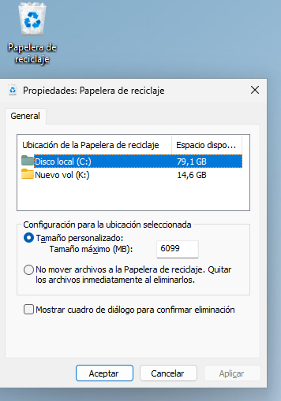

## 4.2 Recuperació

Veiem dos vistes distintes del contingut. 

Per recuperar un arxiu o carpeta eliminat, obrim la paperera dels del GUI i amb botó contrari donem RESTAURAR

Des del CLI també es pot. Ho vorem més avant.

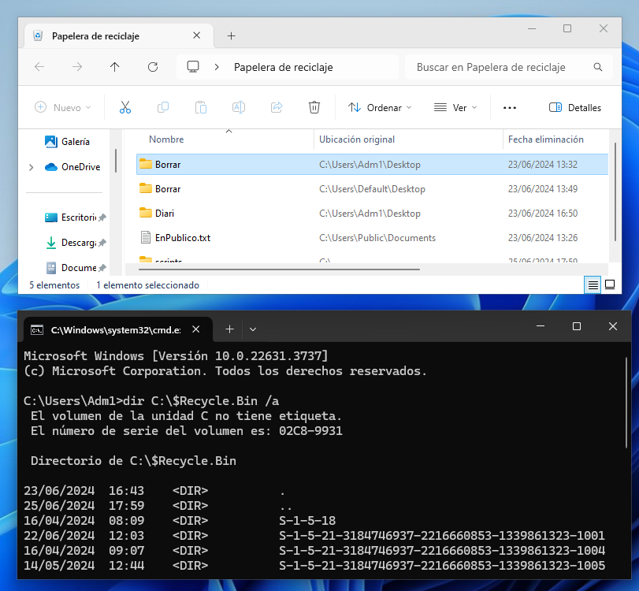

**Advertència**
> Encara que treballem en instal·lacions locals i no ens afecta, convé recordar que si l'eliminació de fitxer de la xarxa no van a la paperera. S'eliminen directament.

**Avanç**
>Una tasca interessant quan s'estudies la programació de tasques seria la de programar un buidat periòdic de la paperera.

# 5 DRECERES

Existeixen algunes combinacions de tecles ( Dreceres ) que ens permeten realitzar accions de manera ràpida i eficient, sense necessitat d'usar el ratolí. 

## 5.1 Drecres comunes

- **Ctrl + C**: Copiar.
- **Ctrl + X**: Tallar.
- **Ctrl + V**: Enganxar, apegar.
- **Ctrl + Z**: Desfer.
- **Ctrl + Y**: Repetir.
- **Ctrl + A**: Seleccionar-ho tot.
- **Ctrl + S**: Desar, alçar o guardar
- **Ctrl + P**: Imprimir.
- **Ctrl + N**: Nou (crea un nou document o finestra, depenent del programa obert).
- **Ctrl + F**: Buscar.
- **Alt + Tab**: Canviar entre les aplicacions obertes.
- **Alt + F4**: Tancar la finestra activa.
- **F2**: Canviar el nom de l'element seleccionat.
- **F5**: Actualitzar la finestra activa.
- **Esc**: Cancel·lar l'acció actual.

## 5.2 Dreceres específiques de Windows

- **Windows + D**: Mostra o amaga l'escriptori.
- **Windows + E**: Obre l'Explorador de Fitxers.
- **Windows + L**: Bloqueja el PC.
- **Windows + R**: Obre el quadre de diàleg Executar.
- **Windows + I**: Obre la configuració de Windows.
- **Windows + Tab**: Obre la Vista de Tasques.
- **Windows + A**: Obre el Centre d'Acció.
- **Windows + S** o **Windows + Q**: Obre la cerca.
- **Windows + X**: Obre el menú d'accés ràpid (menú d'inici ràpid).
- **Windows + V**: Obre l'historial del porta-retalls.
- **Windows + P**: Projectar la pantalla (canviar mode de visualització).

## 5.3 Drecreres per a la gestió de finestres

- **Windows + Fletxa esquerra/dreta**: Anclar la finestra activa a la meitat esquerra o dreta de la pantalla.
- **Windows + Fletxa amunt/avall**: Maximitzar o minimitzar la finestra activa.
- **Windows + Maj + Fletxa esquerra/dreta**: Moure la finestra activa al monitor esquerre o dret en una configuració de monitors múltiples.

## 5.4 Dreceres de la terminal de Windows

- **Ctrl + Maj + N**: Obre una nova finestra de la Terminal amb privilegis d'administrador.
- **Ctrl + Majúscules + T**: Obre una nova pestanya a la Terminal.

## 5.5 Dreceres personalitzades

Pots crear les teues dreceres per a aplicacions específiques:

1.  Fes clic amb el botó dret sobre la icona de l'aplicació i selecciona "Propietats".
2.  A la pestanya "Accés directe", trobaràs el camp "Tecla de drecera".
3.  Fes clic al camp i pressiona la combinació de tecles que vols assignar com a drecera.

L'ús de la drecera **Windows + R** ens servirà per introduir el concepte de Variables del Sistema i concretament la variable **PATH**. 

## 6 ACTIVITATS

### 6.1 Dreceres 

1.  Obri l'explorador usant tres dreceres alternatives.
    a)  La pròpia.
    b)  Sabent que l'executable de l'explorador es *explorer.exe*
    c)  Buscant-lo en el altra drecera pel menú Windows.
    
2. Si la consola de Windows de Admintrador de equipos és *compmgmt.msc*, averigua si tens alguna possible partició a la que assignar una unitat de xarxa (X:)

3. Troba el fitxer *notepad.exe*. 
4. Crea un fitxer *Text1.txt* amb el Bloc de Notes. 
5. Copia'l usant les Dreceres ( Copiar i Enganxar) i renombra el nou com *Text1.rtf*

### 6.2 Configuració de l'explorador    

1.  Configura la carpeta Documents de l'usuari l'explorador de Windows per a que mostre les extensions de tots els fitxer, els fitxers i carpetes ocultes i els protegits de Windows.

2. Configura la vista per veure els detalls o característiques (metainformació) següent:
  * Propietari.
  * Atributs.
  * Data de creació de cada fitxer o subcarpeta.
  * Data en què s'ha accedit per darrera vegada a cada fitxer o subcarpeta.
  * Data en què s'ha modificat per darrera vegada a cada fitxer o subcarpeta.
  
3. Fes que esta configuració s'aplique a totes les carpetes que continguen "documents".
4. Entra en C:\\Windows i assegura't que no es vegen ni les carpetes ocultes ni les protegides pel sistema. 
5. Si fas que no es vegen els fitxers ocults en Documents i vulgueres trobar un a partir del seu nom, ¿podries sense canviar la vista de la carpeta? Pots reproduir-ho creant un fitxer i ocultant-lo?

  