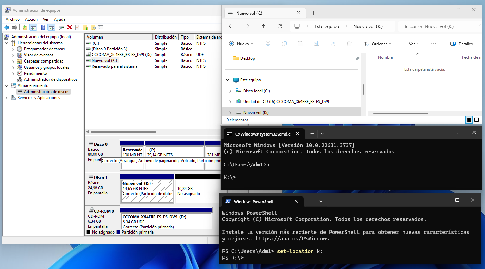

  \newpage
  \renewcommand\tablename{Tabla}

# 1 UNITATS 

Per accedir a qualsevol directori en Windows podem usar unes etiquetes (lletres) que indiquen un inici de ruta. Esta lletra pot indicar.

1.  Una unitat física de memòria secundària: disc dur, pen-drive, tarja externa, DVD...
2.  Una partició d'una unitat fisica de memòria secundaria. 
3.  Una carpeta compartida en un xarxa.

## 1.1 Unitats físiques.

## 1.2 Particions

## 1.3 Carpetes compartides

**Avanç**

> En Windows quan per indicar la ubicació d'un fitxer o carpeta comencem per una unitat, parlarem de *rutes absolutes*. Alguns exemples serien: *C:\\Windows*; *F:\\ParticioDades\\CopiaDeSeguretat*;*  Z:\\UnitatDeXarxa\\FacturesAntigues*

# 2 OPCIONS DE L'EXPLORADOR

L'explorador de Windows és molt versàtil. Ens permet configurar la vista per mostrar-nos i amagar-nos característiques del sistema de fitxers. 
Abans de passar al següents punts necessitem canviar alguna configuració de la vista que ens ve per defecte. Primer escollirem una vista que ens mostre informació sobre els fitxers i carpetes (metadades).

## 2.1 Vista de detalls o metadades

En l'opció VER triem Detalles

## 2.2 Mostrar ocults i extensions

En l'opció "Ver" de cada carpeta, podem triar què volem que ens mostre o oculte. 
Veiem dos canvis convenients per poder treballar com a "Administradors".

* Veure tots els fitxers i carpetes ocultes.
* Veure totes les extensions dels fitxers.

En els **...** desplegar i triar *Opciones*

Podem fer el canvi sobre tota la Unitat o sobre una carpeta. Encara que amb "Aplicar a las carpetas" també s'aplicaria a tota la unitat.

## 2.3 Detalls o característiques a mostrar

# 3. CARPETES PRINCIPALS de WINDOWS 11

## 3.1 PER DEFECTE

En la instal·lació de Windows 11 s'hi creen les carpetes principals següents:

Les funcions són:

* **C:\\Windows** Conté els arxius del sistema operatiu Windows.
* **C:\\Program Files** Conté els programes instal·lats (per a aplicacions de 64 bits).
* **C:\\Program Files** (x86): Conté els programes instal·lats (per a aplicacions de 32 bits).
* **C:\\Users** Conté les carpetes dels usuaris, incloent-hi documents, escriptori, descàrregues, etc.
* **C:\\ProgramData** Emmagatzema les dades de les aplicacions compartides entre tots els usuaris del sistema.
* **C:\\PerfLogs** Conté els registres de rendiment i diagnòstic del sistema.
* **C:\\Recovery** Emmagatzema els arxius necessaris per a la recuperació del sistema.

## 3.2 NOVES CARPETES

A la unitat C:\\ poden crear-se'n més en funció de posteriors configuracions i instal·lacions. 

Per exemple:

* Si activem la recuperació del sistema es crea la carpeta **C:\\$Recycle.bin**
* Si instal·lem el MS Office s'hi crea **C:\\MSOCache**

**Notes**

>* El "$" com a inici de no de carpeta és una forma d'ocultar la carpeta. 
>* Si no tenim habilitada l'opció de mostrar carpetes i arxius ocults (com hem vist adés) no veiem estes carpetes.
>* Hi ha altra forma d'ocultar amb atributs que estudiarem més avant.

# 4. PAPERERA DE RECICLATGE

Quan eliminem un fitxer o carpeta d'una unitat local, amb la configuració per defecte, encara el podem recuperar perquè s'hi queda a la *Paperera de reciclatge*.

## 4.1 Configuració

Veiem què podem configurar a la paperera:

* Màxima quantitat d'informació o tamany.
* Desactivar-la per que l'eliminació siga definitiva (equival a polsar SHIFT + Suprimir).
* Mostrar un avís de confirmació abans de la supressió.

## 4.2 Recuperació

Veiem dos vistes distintes del contingut. 

Per recuperar un arxiu o carpeta eliminat, obrim la paperera dels del GUI i amb botó contrari donem RESTAURAR

Des del CLI també es pot. Ho vorem més avant.

**Advertència**
> Encara que treballem en instal·lacions locals i no ens afecta, convé recordar que si l'eliminació de fitxer de la xarxa no van a la paperera. S'eliminen directament.

**Avanç**
>Una tasca interessant quan s'estudies la programació de tasques seria la de programar un buidat periòdic de la paperera.

# 5 DRECERES

Existeixen algunes combinacions de tecles ( Dreceres ) que ens permeten realitzar accions de manera ràpida i eficient, sense necessitat d'usar el ratolí. 

## 5.1 Drecres comunes

- **Ctrl + C**: Copiar.
- **Ctrl + X**: Tallar.
- **Ctrl + V**: Enganxar.
- **Ctrl + Z**: Desfer.
- **Ctrl + Y**: Repetir.
- **Ctrl + A**: Seleccionar tot.
- **Ctrl + S**: Desar.
- **Ctrl + P**: Imprimir.
- **Ctrl + N**: Nou (crea un nou document o finestra, depenent de l'aplicació).
- **Ctrl + F**: Buscar.
- **Alt + Tab**: Canviar entre les aplicacions obertes.
- **Alt + F4**: Tancar la finestra activa.
- **F2**: Canviar el nom de l'element seleccionat.
- **F5**: Actualitzar la finestra activa.
- **Esc**: Cancel·lar l'acció actual.

## 5.2 Dreceres específiques de Windows

- **Windows + D**: Mostra o amaga l'escriptori.
- **Windows + E**: Obre l'Explorador de Fitxers.
- **Windows + L**: Bloqueja el PC.
- **Windows + R**: Obre el quadre de diàleg Executar.
- **Windows + I**: Obre la configuració de Windows.
- **Windows + Tab**: Obre la Vista de Tasques.
- **Windows + A**: Obre el Centre d'Acció.
- **Windows + S** o **Windows + Q**: Obre la cerca.
- **Windows + X**: Obre el menú d'accés ràpid (menú d'inici ràpid).
- **Windows + V**: Obre l'historial del porta-retalls.
- **Windows + P**: Projectar la pantalla (canviar mode de visualització).

## 5.3 Drecreres per a la gestió de finestres

- **Windows + Fletxa esquerra/dreta**: Anclar la finestra activa a la meitat esquerra o dreta de la pantalla.
- **Windows + Fletxa amunt/avall**: Maximitzar o minimitzar la finestra activa.
- **Windows + Maj + Fletxa esquerra/dreta**: Moure la finestra activa al monitor esquerre o dret en una configuració de monitors múltiples.

## 5.4 Dreceres de la terminal de Windows

- **Ctrl + Maj + N**: Obre una nova finestra de la Terminal amb privilegis d'administrador.
- **Ctrl + Maiúscules + T**: Obre una nova pestanya a la Terminal.

## 5.5 Dreceres personalitzades

Pots crear les teues dreceres per a aplicacions específiques:

1.  Fes clic amb el botó dret sobre la icona de l'aplicació i selecciona "Propietats".
2.  A la pestanya "Accés directe", trobaràs el camp "Tecla de drecera".
3.  Fes clic al camp i pressiona la combinació de tecles que vols assignar com a drecera.

L'ús de la drecera **Windows + R** ens servirà per introduir el concepte de Variables del Sistema i concretament la variable **PATH**. 
