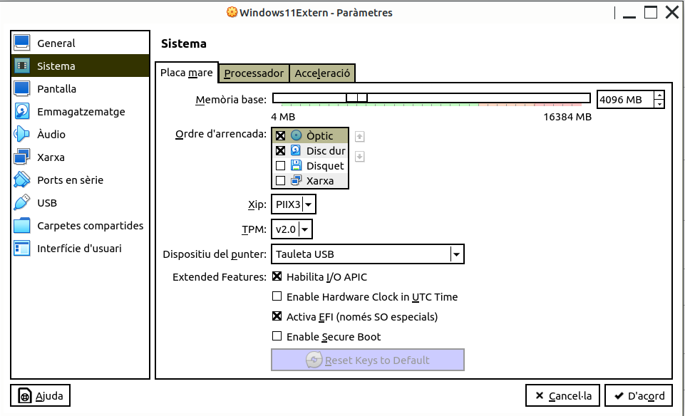
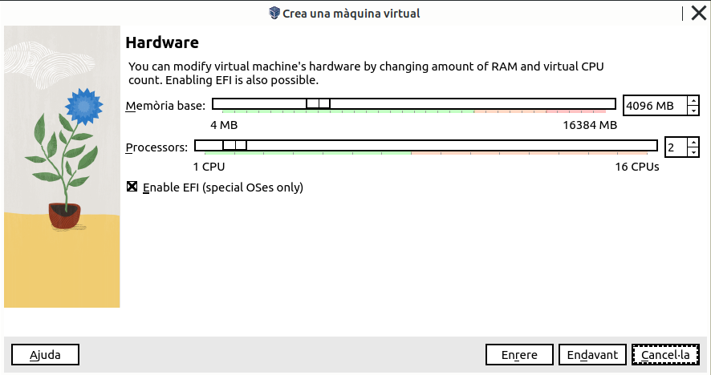
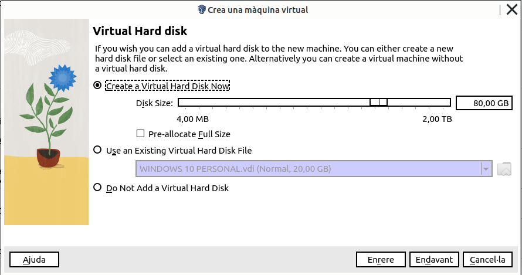
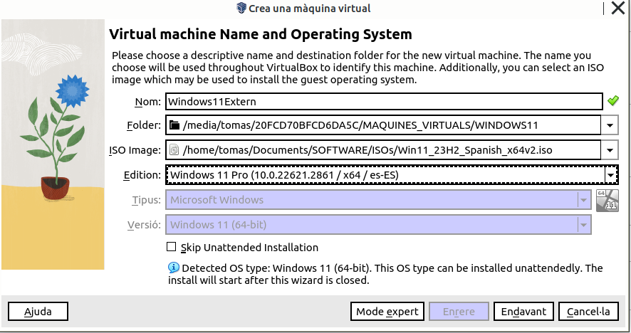
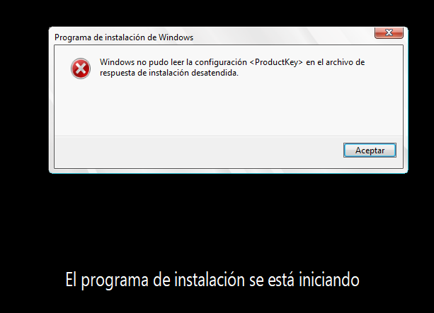
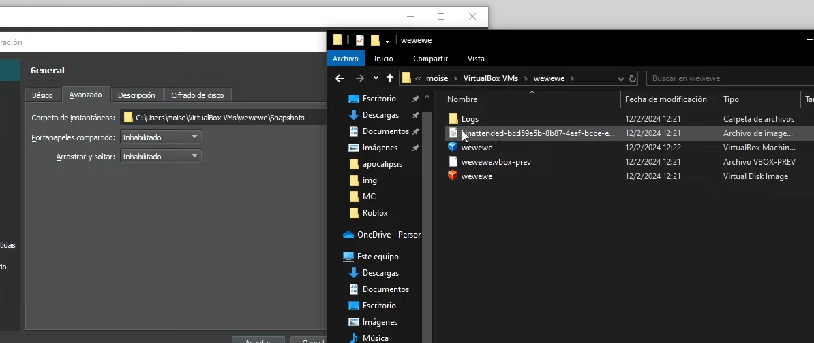

\newpage

\renewcommand\tablename{Tabla}

# Resum

El següent document només conté alguns recordatoris i consells sobre la instal·lació d'un Windows 11 en una VirtualBox.

# 1 Recursos

# 2 Consideracions en la instal·Lació de VirtualBox

En crear i configurar la màquina, hem de revisar el l'ordre d'arrencada de la màquina.

* Convé desmarcar el Disquette.
* Seleccionar TPM (Versió 2.0)
* Activar la EFI

El TPM (Mòdul de Plataforma Segura) és un xip de seguretat que emmagatzema claus criptogràfiques i dades sensibles en un ordinador. Ajuda a protegir el sistema operatiu i a evitar accessos no autoritzats, especialment en funcions com el xifratge de disc o l'autenticació segura.            

{width=70%}

Vegem les característiques de HW necessari.

{width=70%}

{width=70%}

En crear la màquina virtual hem d'especificar en quin disc volem que s'instal·le.

Per poder instal·lar en un **DISC EXTRAÏBLE** només hem d'especificar la carpeta destí en l'aparatat **FOLDER**

{width=70%}

# 3 Error habitual...

Un error habitual és el següent...

{width=70%}

**La solució** consisteix en elimimar un fitxer de la carpeta de les instatànies.

{width=90%}
