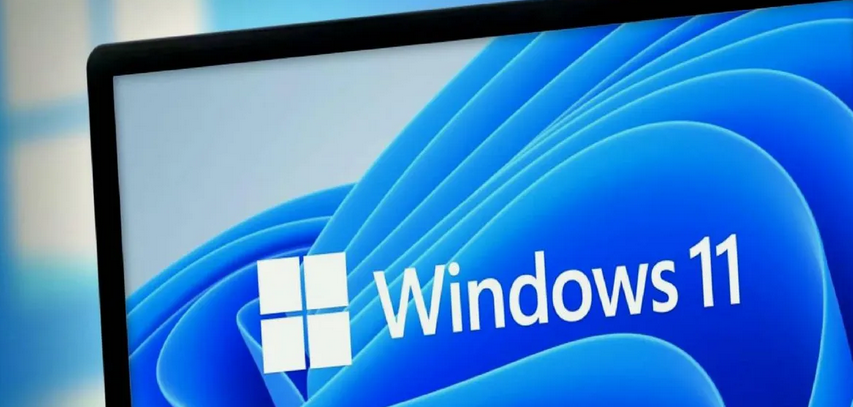

# WINDOWS 11

Tomàs Ferrandis Moscardó tomasferrandis@gmail.com  

||]|
|:------------------|----:|
1. [Instal·lació Windows 11](manteniment/instalar.md)|
2. [Recuperació de la instal·lació Windows 11](manteniment/recuperar.md)|  
3. [Introducció a l'interface gràfic GUI)](interfaces/interfaces.md)|
4. [Introducció al sistema de fitxers](sf/fitxers.md)|
5. [Gestió de comptes locals (usuaris i grups)](gestions/comptesLocals.md)|
6. [Instal·lació i desintal·lació de Software](software/software.md)|
7. [Atributs, propietat i permisos SHARE](gestions/permisos.md)|

|||
|:------|--:|
|*©tofermos 2024 by Tomàs Ferrandis Moscardó is licensed under CC BY-NC-ND 4.0*|{width=30%}|
