  \newpage
  \renewcommand\tablename{Tabla}

# 1 INSTAL·LACIÓ

## 1.1 FITXERS MSI

Els fitxers amb extensió MSI ( Microsoft Installer) son paquets per a instal·lació , desinstal·lació i manteniment de softwarer ne sistemes Windows.


Des del GUI podem executar com adminsitrador i instal·lar. 
Des del CLI, cmd, veiem com sería la instal·lació:

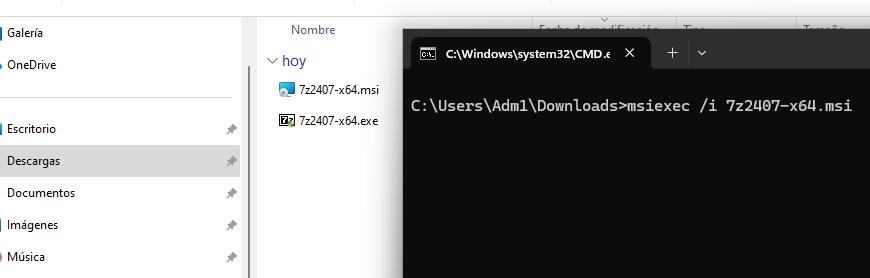

```cmd
msiexec /i 7z2407-x64.msi
```
Comença la instal·lació

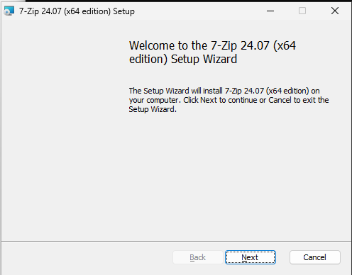

Ens informa i demana consentiment de la llicència.
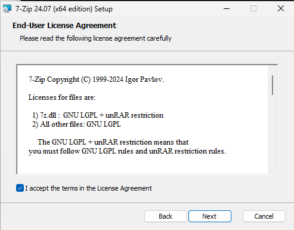

Per defecte s'instal·la en "C:\\Program Files" però normalment podríem canviar la carpeta destí de la instal·lació.

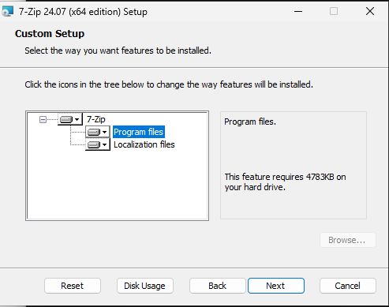

El SO ens avisa de l'intent de instal·lar-se i ens demana autorització.
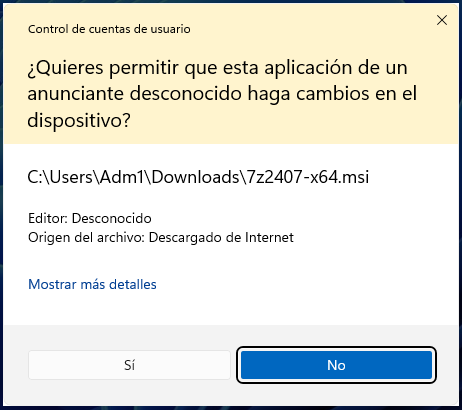

Una vegada finalitzada la instal·lació, comprovem que existeix i provem el programa. Molt sovint, al final de la instal·lació se'ns demana reiniciar el PC.

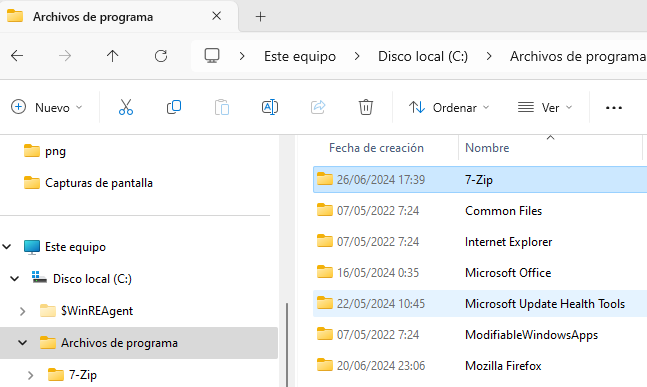


## 1.2 FITXERS .EXE

Els fitxers amb extensió *.exe* són executables de programes amb moltes possibles funcions. Des d'aplicacions d'usuari (calc.exe, winword.exe), components del sistema operatiu (regedit.exe, netplwiz.exe); eines com IDE per a programar (android-studio-2023.1.ex, VSCodeSetup-x64-1.72.0.exe ); eines per a l'execució de codi com intérprets, màquines virtuals... 

El que ens interessa ara són el .exe que serveixen per instalar software. A diferència del .msi, no necessiten cap altre programa i només cal executar-los com a administrador. Solne tindre noms com "installer.exe" o "setup.exe".

## 1.3 FITXERS .inf PER INSTAL·LAR I CONFIGURAR DISPOSITIUS HARDWARE

No són fitxers amb codi executable. Sinó que contenen informació de text pla (caràters llegibles i editable per nosaltres) amb informació sobre el controlador d'un dipositiu que Windows llig per a instal·lar-lo. 

Exemple:
```
[Version]
Signature="$Windows NT$"
Class=Printer
ClassGuid={4D36E979-E325-11CE-BFC1-08002BE10318}
Provider=%ProviderName%
DriverVer=07/01/2021,1.0.0.0

[Manufacturer]
%ManufacturerName%=PrinterManufacturer,NTamd64

[PrinterManufacturer.NTamd64]
%ModelName%=Install,USBPRINT\PrinterModel

[Install]
CopyFiles=@PrinterDriver.dll
AddReg=PrinterAddReg

[PrinterAddReg]
HKR,,PortNumber,,"USB001"

[SourceDisksNames]
1 = %DiskName%,,,""
...
```

## 1.4 ALTRES

### bat (Batch File) i .cmd
Arxiu script que puede ejecutar comandaments de Windwos. S'usa poc hui en dia i només en instal·lacions senzilles.
Nom típic: *install.bat*

Els .cmd son similars a .bat, pero executats pel cmd.exe.
Exemple: *install.cmd*

### .msix/.appx

Formatos més recents Microsoft per empaquetar aplicacions de la Botiga de Windows.
Exemples: appinstaller.msix, application.appx.

# 2 DESINSTAL·LACIÓ

Qualsevol desinstal·lació d'un programa ens obligarà a tancar-lo com a primer pas. Una vegada tancat veiem diverses formes de desinstal·lar, modificar o reparar la instal·lacio d'un programa.

## 2.1  DESDE l'APPLET DEL PANEL DE CONTROL

Com ja anem veient, al GUI de Windows, hi ha molts "camins diferents" per arribar al mateix lloc quan l'objectiu final és l'execució d'un component de Windows o un programa instal·lat. En el nostre cas burcarem el component o ferramenta per a desinstal·lar programes.

**Per entrar al *Panel de control* **
Des del menú de Windows ( Win +S o Win i escrivint "panel...") o 
executant Win+R: control

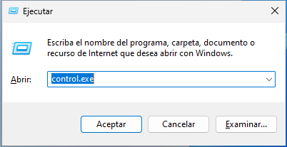

**i ja per desinstal·lar o modificar la instal·lació d'un programa...**
Seleccionem **Programas y características**. Este element de Windows, a banda de modificar i eliminar una instal·lació, ens permet veure caraterístiques com l'espai del disc dur que ocupa la instal·lació.

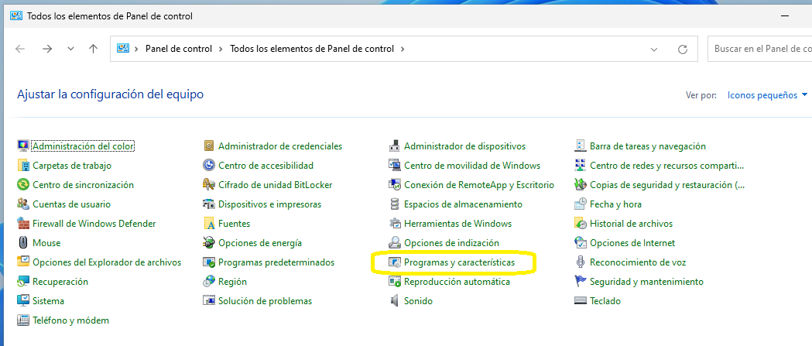

Seleccionen el programa a desinstal·lar o canviar i amb el botó contrari triem l'opció que volem: 

* Desinstal·lar el programa. Pot demanar-nos (i és recomanable) reiniciar l'equip en acabar. 
* Fer algun canvi en la instal·lació existent.
* Reparar a instal·lació. Pot demanar-nos els fitxers originals de la instal·lació.


Ens tornarà a advertir de l'intent de modificar el software i demanarà autorització.


**Avanç**

>Els Applets del Panel de Control són components, com este que estem veient, que tenen extensió *.cpl*. Poden executar-se directament:


## 2.2  AMB .MSI

Si la instal·lació sha fet a partir d'un fitxer *.msi*, tal com hem comentat, els fitxer MSI serveixen no sols per instal·lar, també per desintal·lar.

```cmd
msiexec /x 7z2407-x64.msi
```

Però el més habitual és que ja no conservem el .msi. En este cas, necessitarem esbrinar l'identificador de programa buscant pel nom del programa dins del Registre de Windows (Win+R regedit.exe)
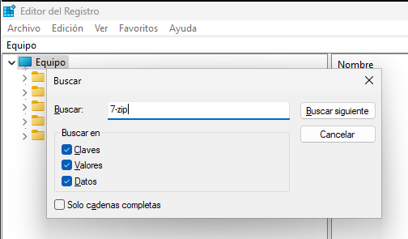

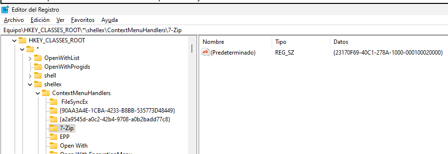


Alternativament podríem fer ús de l'eina WIMC. De moment no ho estudiarem.
```cmd
wmic product get Name, identifyingnumber
```
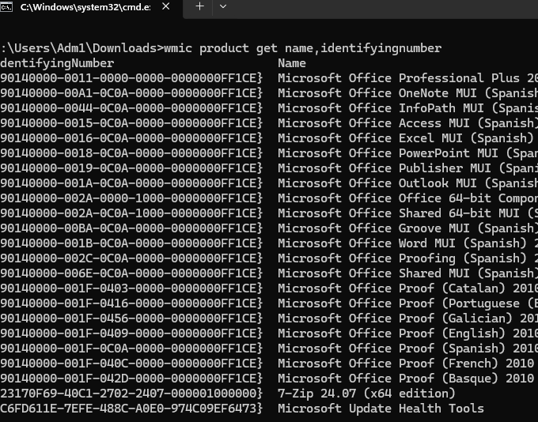

O de PowerShell. De moment no ho estudiarem.
```powershell
Get-WmiObject -Class Win32_Product | Select-Object Name, IdentifyingNumber
```

Una vegada sabem el GUID de la instal·lació ja podem fer la desinstal·lació.

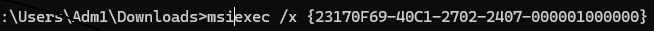

```cmd
msiexec /x { GUID }
```
# 3 INTEGRITAT DELS PAQUETS

Molt sovint els fabricants de software posen a la nostra disposició la possibilitat de comprovar si la descàrrega d'un fitxer s'ha fet correctament (verificar la integritat del fitxer, que no hi haja cap bloc corrupte).
Sobretot quan el tamany del fitxer és elevat. És el cas dels fitxer ISO de molts paquets de software i, concretament, dels Sistemes Operatius. 

Per a tal cosa, se'ns aporta un codi que és el resultat d'aplicar una funció al conjunt de bits que formen el fitxer. 
Nosaltres el que hem de fer és aplicar la mateixa funció al fitxer descarregat i comprovar que ens dona el mateix número.

## 3.1 Funció SHA256

SHA-256 o Secure Hash Algorithm 256 bits és una función hash criptográfica que genera un valor hash único per a un fitxer. 
S'usa per a verificar la integritat de les dades assegurant que no hi ha haguts canvis entre el fitxer final i l'original en una còpia, descàrrega, enviament...

El powershell no cal dominar-lo encara però és interessant que conegam que implementa funcions com esta.

```powershell
Get-FileHash C:\Users\Adm1\Downloads\FitxerDescarregat.iso
```
## 3.2 Comprovació de la ISO del Windows 11.

1.  Seleccionem la ISO que necessitem: 64 bits, Español- España.

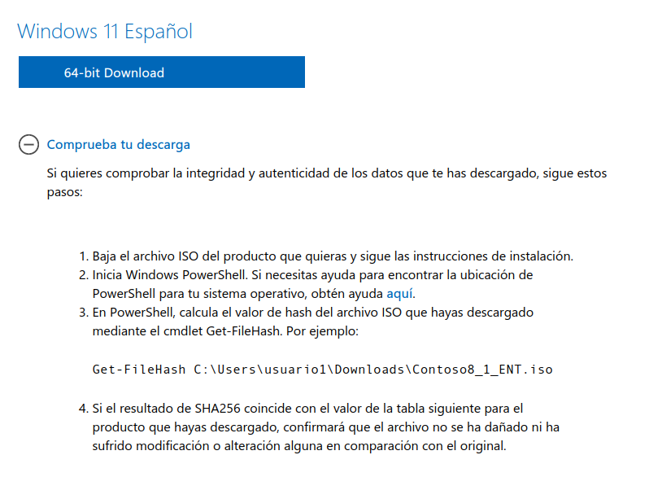

2. Anotem el codi SHA256 que ens ha de donar. en este cas la funció que Microsoft ha usat el la SHA256

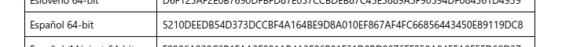

3. Obrim el Powershell i ens situem en la carpeta on està la ISO i executem la funció.

(si tenim dificultats per moure'ns amb els cmdLets, podem situar-nos en la carpeta abans d'executar la funció GetHash)

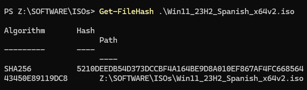

4. Comprovem a colp de vista (almenys) que els codis coincideixen. En cas contrari hem tingut algun problema desant el fitxer: la ISO no sería vàlida.

# 4 ACTIVITATS

# 4.1 Instal·lació des de .exe
1. Descarrega el Opera.exe per a Windows 64 bits
[https://www.opera.com/es/download](https://www.opera.com/es/download)

2. Instal·la'l.

3. Averigua en quins directoris està instal·lat.

## 4.2 Instal·lació des d'un .msi

1.  Descarrega't el paquet d'instal·lació del navegador Firefox en msi en valencià de la web: 

[https://www.mozilla.org/es-ES/firefox/all/#product-desktop-release](https://www.mozilla.org/es-ES/firefox/all/#product-desktop-release)

Fixeu-vos en triar l'opció de 64bits i MSI

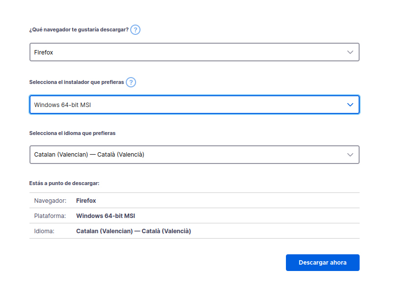

2.  Instal·la des del cmd.

3.  Mira en quins directoris de Windows s'ha instal·lat.

4.  Investiga quin dels dos navegadors (FireFox i Opera) ocupa més espai al disc dur.

5.  Busca al registre de Windows el GUID 

6.  Elimina el fitxer .msi

7.  Desinstal·la el FireFox des de cmd usant l'identificador identificador GUID.

## 4.3 Comprovació SHA256

1.  Descarrega't un Windows 11 per al teu PC particular o portàtil.
2.  Comprova que la ISO descarregada és vàlida.
